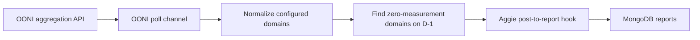

# OONI integration architecture

## Purpose

This integration monitors OONI `web_connectivity` measurement volume for two
Iranian mobile networks:

| Network | ASN |
| --- | --- |
| IranCell | AS44244 |
| MCCI | AS58224 |

It reuses Aggie's existing sources, polling channels, report hooks, and MongoDB
reports collection. It does not introduce another service or database.

## Data flow



The channel polls hourly. Before 06:00 UTC, it evaluates the day before the
previous UTC day. At and after 06:00 UTC, it evaluates the previous UTC day.

For each configured ASN in the default selected-domain mode it requests:

- `probe_cc=IR`
- `probe_asn=<asn>`
- `test_name=web_connectivity`
- `axis_x=domain`

The configured 50-domain watchlist lives in
`backend/fetching/config/ooni.json`. The API omits domains with no
measurements, so every configured domain absent from the response becomes a
`zero_domain_measurements` trigger. One report groups all such triggers for an
ASN and day. When `useAllDomains` is `true`, the channel instead uses
`axis_x=measurement_start_day` and retains the original ASN-wide zero rule.

## Report format

Selected-domain alerts use the GUID:

```text
ooni:<asn>:domains:<alert-date>
```

All-domain alerts retain `ooni:<asn>:volume:<alert-date>`. Separate namespaces
allow changing modes without suppressing an alert from the other mode.

The channel checks for an existing report before enqueueing. The report model's
unique `guid` index provides the final database-level duplicate guard.

The channel emits platform `ooni`, an OONI Explorer URL, and raw metadata shaped
like this:

```json
{
  "probeCC": "IR",
  "probeASN": 44244,
  "networkName": "IranCell",
  "testName": "web_connectivity",
  "entityLevel": "AS",
  "alertDate": "2026-01-10",
  "domainMode": "selected",
  "configuredDomains": ["www.wechat.com"],
  "zeroDomains": ["www.wechat.com"],
  "triggers": [
    {
      "type": "zero_domain_measurements",
      "domain": "www.wechat.com",
      "alertDate": "2026-01-10",
      "measurementDay": "2026-01-09",
      "measurementCount": 0
    }
  ]
}
```

The post also sets `isOutageEvent`, `isAsnScoped`, and `asn`, allowing the
existing Alerts query to retrieve it. `postToReport` stores the raw object as
`metadata.rawAPIResponse`, assigns the source and tags, and saves the post
through the normal report pipeline.

## Implementation files

- `backend/fetching/ooniApi.js`: OONI aggregation API client.
- `backend/fetching/ooniAlerts.js`: date normalization and zero-only evaluator.
- `backend/fetching/config/ooni.json`: selected/all mode and the default 50-domain watchlist.
- `backend/fetching/channels/ooni.js`: hourly polling and report creation.
- `backend/fetching/sourceToChannel.js`: creates an OONI channel from a source.
- `backend/fetching/hooks/postToReport.js`: stores OONI metadata.
- `backend/config/models/sourceConfigs.js`: registers the `ooni` source type.
- `backend/config/models/credentialsConfigs.js`: registers the public credential type.
- `scripts/backtest-ooni-alerts.js`: historical evaluation and JSON/CSV export.
- `src/pages/Settings/Credentials/CreateCredentialForm.tsx`: creates no-secret OONI credentials.
- `src/pages/Settings/source/CreateEditSourceForm.tsx`: creates and edits ASN lists.
- `src/components/SocialMediaPost/OoniEvent.tsx`: renders OONI alert details.
- `src/pages/Reports/TableView/CompareCardBody.tsx`: compares OONI alerts without chart assumptions.

## Tests

Run focused tests with:

```powershell
npm run test:ooni
```

The tests cover missing-day and missing-domain normalization, selected/all
mode, zero and nonzero decisions, API query construction and failures, ASN
validation, deterministic 06:00 UTC date selection, report content, and
duplicate suppression.

## Limitations

- Country code and known network names are intentionally Iran-specific.
- Consecutive zero days create separate daily reports.
- API retries and an incident-level cooldown are not included.
- Measurement-decline alerts, offline domain-leading-indicator research, and
  full application containerization are not included. Docker is used only by
  the Windows setup script for local MongoDB.