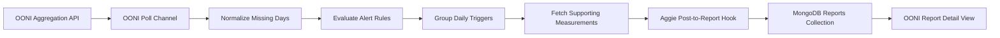

# Everything About the OONI Integration

## Purpose

This integration adds OONI `web_connectivity` measurement-volume monitoring to
Aggie for two Iranian mobile networks:

| Network | ASN |
| --- | --- |
| IranCell | AS44244 |
| MCCI | AS58224 |

The integration uses Aggie's existing source, polling, report, and MongoDB
infrastructure. It does not introduce a separate service or database.

## Requested Alert Rules

For each ASN, Aggie evaluates the OONI measurement volume once a day using only
completed UTC days.

For alert date `D`:

1. `zero_measurements`: the total `measurement_count` on `D-1` is zero.
2. `measurement_decline`: the average measurement count for `D-2` through
   `D-1` is at least 30% below the average for `D-16` through `D-3`.

Only non-zero values are included when calculating the 14-day baseline. The
recent two-day window and the preceding 14-day baseline do not overlap.

These are measurement-volume alerts aggregated across all `web_connectivity`
tests for an ASN. They are not individual website-failure alerts.

## Daily Timing

The OONI channel polls hourly. It waits until 06:00 UTC before evaluating the
previous completed day. This delay gives OONI time to publish the previous day's
aggregates and reduces false zero-measurement alerts.

## Grouped Reports

If zero volume and a 30% decline trigger for the same ASN and alert date, Aggie
creates one report containing both triggers.

The report GUID follows this format:

```text
ooni:<asn>:volume:<alert-date>
```

For example:

```text
ooni:44244:volume:2026-01-10
```

This deterministic GUID prevents duplicate reports when the hourly poll runs
again.

## Supporting Website Evidence

A decline report includes selected website-level OONI measurements from its
recent two-day window:

- Up to five confirmed measurements.
- Up to five anomalous but non-confirmed measurements.

Confirmed and anomalous entries do not overlap.

These measurements provide context. They are not presented as proof that a
particular website caused the measurement-volume decline.

A zero-only alert has no measurements for the zero day, so it displays:

```text
No measurements were available on the zero-measurement day.
```

If the optional evidence request fails, the core volume alert is still stored.
The report displays the evidence-loading error instead of dropping the alert.

### OONI Result Meanings

- `confirmed: true`: OONI found stronger interference evidence, such as a known
  block page or middlebox fingerprint.
- `anomaly: true`: the result needs attention and may indicate interference, but
  it is not confirmed.
- `failure: true`: the test or control request failed. This does not
  automatically mean censorship.

## Example Stored Report

```json
{
  "guid": "ooni:44244:volume:2026-01-10",
  "authoredAt": "2026-01-10T00:00:00.000Z",
  "author": "OONI AS44244",
  "content": "OONI volume alert for IranCell (AS44244): no web connectivity measurements were recorded on 2026-01-09; the 2-day measurement average declined 100.0%.",
  "_media": ["OONI"],
  "metadata": {
    "rawAPIResponse": {
      "probeCC": "IR",
      "probeASN": 44244,
      "networkName": "IranCell",
      "testName": "web_connectivity",
      "alertDate": "2026-01-10",
      "triggers": [
        {
          "type": "zero_measurements",
          "measurementDay": "2026-01-09",
          "measurementCount": 0
        },
        {
          "type": "measurement_decline",
          "recentStart": "2026-01-08",
          "recentEnd": "2026-01-09",
          "recentCounts": [0, 0],
          "recentAverage": 0,
          "baselineStart": "2025-12-25",
          "baselineEnd": "2026-01-07",
          "baselineNonZeroDays": 14,
          "baselineAverage": 1216.43,
          "declineFraction": 1
        }
      ],
      "evidence": {
        "available": true,
        "windowStart": "2026-01-08",
        "windowEnd": "2026-01-09",
        "confirmed": [],
        "anomalous": []
      }
    }
  }
}
```

## Architecture



## Database Storage

OONI alerts use the same MongoDB `reports` collection as other Aggie reports.
They contain:

- Alert summary and timestamps.
- ASN and network name.
- Trigger details.
- Recent and baseline counts.
- Decline percentage.
- Selected confirmed and anomalous measurements.
- OONI measurement and Explorer links.
- Aggie source and media identifiers.
- A deterministic deduplication GUID.

The OONI source and polling configuration use Aggie's existing `sources` and
`credentials` collections. OONI is public, so its credential record does not
contain an API token.

## Backend Files

### `backend/fetching/ooniApi.js`

Calls the public OONI APIs:

- Aggregation endpoint for daily measurement counts.
- Measurements endpoint for confirmed and anomalous evidence.

The evidence endpoint is queried directly for at most five confirmed and five
anomalous, non-confirmed measurements.

### `backend/fetching/ooniAlerts.js`

Contains dependency-free alert logic:

- Fills omitted calendar dates with zero measurements.
- Calculates the two-day recent average.
- Calculates the preceding 14-day non-zero baseline.
- Produces zero and decline trigger objects.

Keeping this logic separate allows the real-time channel and historical
backtest to use the same calculations.

### `backend/fetching/channels/ooni.js`

Implements the native Aggie `PollChannel`. It:

- Parses configured ASNs.
- Polls OONI hourly.
- Applies the 06:00 UTC publication delay.
- Fetches daily aggregate counts.
- Evaluates and groups triggers.
- Fetches bounded supporting evidence.
- Creates deterministic GUIDs.
- Enqueues reports through Aggie's normal fetching pipeline.
- Preserves the core alert when evidence lookup fails.

### `backend/fetching/sourceToChannel.js`

Creates an `OONIChannel` when Aggie loads a source with media type `ooni`.
The source's existing `lists` field stores space- or comma-separated ASNs.

### `backend/fetching/hooks/postToReport.js`

Converts OONI channel posts into standard Aggie reports and stores OONI data in
`metadata.rawAPIResponse`.

### `backend/models/source.js`

Adds `ooni` to the valid source media types.

### `backend/models/credentials.js`

Adds `ooni` as a valid credential type. The record exists to follow Aggie's
current source/credential relationship, but no secret is required.

## Frontend Files

### `src/pages/Settings/Credentials/CreateCredentialForm.tsx`

Adds a token-free OONI credential form.

### `src/pages/Settings/source/CreateEditSourceForm.tsx`

Adds the OONI source form. Its default ASN list is:

```text
44244 58224
```

### `src/api/common.ts`

Adds OONI to frontend media and credential options.

### `src/objectTypes.d.ts`

Adds `OONI` to the frontend media type declaration.

### `src/components/SocialMediaPost/SocialMediaIcon.tsx`

Displays a globe icon for OONI reports.

### `src/components/SocialMediaPost/OONIPost.tsx`

Renders the expanded OONI report view with:

- Network, ASN, and alert date.
- Every triggered volume rule.
- Recent daily counts.
- Recent and baseline averages.
- Baseline period and non-zero day count.
- Decline percentage.
- Up to five confirmed measurements.
- Up to five anomalous measurements.
- Blocking type and verification status.
- Links to raw OONI measurements.
- Clear language distinguishing context from causation.

### `src/components/SocialMediaPost/index.tsx`

Routes reports with media type `OONI` to `OONIPost`.

## Backtest and Tests

### `scripts/backtest-ooni-alerts.js`

Runs the same alert evaluator used by the production channel from December 1,
2025 through a specified end date.

Run it with:

```powershell
npm run backtest:ooni -- 2026-07-30
```

It writes:

```text
data/ooni-alert-backtest.json
data/ooni-alert-backtest.csv
```

The `data` directory is ignored by Git.

### `test/backend/lib.fetching.ooni-alerts.test.js`

Tests:

- Missing aggregation days becoming zero counts.
- Zero-measurement triggers.
- The 30% decline calculation.
- Disjoint recent and baseline windows.
- Exclusion of zero values from the baseline.

### `package.json`

Adds the `backtest:ooni` command.

## Historical Results

Backtest period: December 1, 2025 through July 30, 2026.

| ASN | Grouped reports | Zero triggers | Decline triggers |
| --- | ---: | ---: | ---: |
| AS44244, IranCell | 124 | 89 | 115 |
| AS58224, MCCI | 109 | 98 | 68 |
| Total | 233 | 187 | 183 |

Emitting every trigger separately would have generated 370 reports. Grouping
both rules by ASN and date produces 233 reports, which is 137 fewer reports and
a 37% reduction.

The trigger totals exceed the report total because one grouped report can
contain both rules.

## Aggie Configuration

1. Open Settings and then Credentials.
2. Create an `ooni` credential. No token is required.
3. Open Settings and then Sources.
4. Create an `ooni` source.
5. Select the OONI credential.
6. Keep or enter the ASN list `44244 58224`.
7. Enable the source.
8. Turn global fetching on.

After configuration, future qualifying dips create reports automatically.

## Validation Completed

The following checks passed:

- JavaScript syntax checks for all OONI backend files.
- Editor diagnostics for modified JavaScript and TypeScript files.
- Synthetic zero-day and 30% decline checks.
- Non-zero baseline exclusion check.
- Live OONI aggregation requests for both ASNs.
- Live OONI confirmed-measurement query.
- Live OONI anomalous and non-confirmed measurement query.
- Five-confirmed and five-anomalous evidence limits.
- Grouped JSON and CSV reconciliation at 233 reports.
- Git whitespace validation.

A full npm build and full repository test run remain pending because this
machine's network policy currently rejects TLS connections to
`registry.npmjs.org`. The OONI API itself is reachable and the integration logic
has been validated against live data.

## Current Limitations

- There is no incident-level cooldown beyond grouping rules by ASN and day.
- Website evidence is attached only to decline alerts, because zero days have no
  measurements.
- Evidence is a bounded sample, not every measurement in the period.
- The production channel must be enabled in Aggie before polling begins.
- End-to-end runtime verification requires the repository dependencies to be
  installed.
